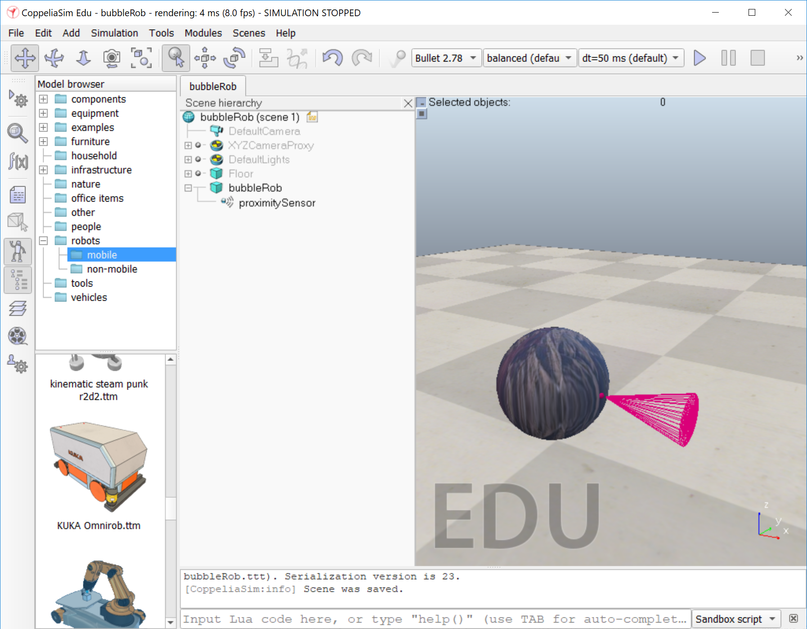

# BubbleRob tutorial

**This is an updated version of the  [CoppeliaSim BubbleRob Tutorial](https://www.coppeliarobotics.com/helpFiles/en/bubbleRobTutorial.htm) which addresses some errors/typos and translates the scripts to Python.**

This tutorial will introduce many CoppeliaSim functionalities while designing the simple mobile robot _BubbleRob_.  The figure below illustrates the simulation scene that we will design:


Since this tutorial will fly over many different aspects, make sure to **click on all the links in each of the instructions to learn more about each of the menus and settings**, and also have a look at the [other tutorials.](https://www.coppeliarobotics.com/helpFiles/en/tutorials.htm) First of all, freshly start CoppeliaSim. The simulator displays a default [scene](https://www.coppeliarobotics.com/helpFiles/en/scenes.htm). We will start with the body of _BubbleRob_.

## Creating bubbleRob

### Adding a Sphere

1.  Add a primitive sphere of diameter 0.2 to the scene with [Menu bar > Add > Primitive shape > Sphere]. Adjust the **X-size** item to 0.2, then click **OK**. The created sphere will appear in the [visibility layer](https://www.coppeliarobotics.com/helpFiles/en/layerSelectionDialog.htm) 1 by default, and be [dynamic and respondable](https://www.coppeliarobotics.com/helpFiles/en/designingDynamicSimulations.htm#staticAndRespondable) (since we kept the item **Create dynamic and respondable shape** enabled). This means that _BubbleRob's_ body will be falling and able to react to collisions with other respondable shapes (i.e. simulated by the physics engine). We can see this is the [shape dynamics properties](https://www.coppeliarobotics.com/helpFiles/en/shapeDynamicsProperties.htm): items **Body is respondable** and **Body is dynamic** are enabled.
2.  Start the simulation (via the toolbar button, or by pressing <control-space> in the scene window), and copy-and-paste the created sphere (with [Menu bar > Edit > Copy selected objects] then [Menu bar > Edit -> Paste buffer], or with <control-c> then <control-v>): the two spheres will react to collision and roll away. When you stop the simulation, the duplicated sphere will automatically be removed. This default behaviour can be modified in the [simulation dialog](https://www.coppeliarobotics.com/helpFiles/en/simulationPropertiesDialog.htm). (Make sure to stop the simulation before continuing).
3.  We also want the _BubbleRob's_ body to by usable by the other calculation modules (e.g. [distance calculation](https://www.coppeliarobotics.com/helpFiles/en/distanceCalculation.htm)). For that reason, enable [Collidable](https://www.coppeliarobotics.com/helpFiles/en/collidableObjects.htm), [Measurable](https://www.coppeliarobotics.com/helpFiles/en/measurableObjects.htm) and [Detectable](https://www.coppeliarobotics.com/helpFiles/en/detectableObjects.htm) in the [object common properties](https://www.coppeliarobotics.com/helpFiles/en/commonPropertiesDialog.htm) for that shape, if not already enabled.
4.  In the [shape properties](https://www.coppeliarobotics.com/helpFiles/en/shapeProperties.htm), select **Adjust texture** to open the texture menu.  Textures allow you to load an image onto a shape. Click **Load new texture** and select an image of your choice.  You can adjust the scaling of the texture to change the resolution of the texture on the object. 
5.  Open the [position dialog](https://www.coppeliarobotics.com/helpFiles/en/positionDialog.htm) on the **translation** tab, select the sphere representing _BubbleRob's_ body, and enter 0.02 for **Along Z**. Make sure that the **Relative to**\-item is set to **World**, then click **Translate selection**. This translates all selected objects by 2 cm along the absolute Z-axis, and effectively lifted the sphere a little bit.
6.  In the [scene hierarchy](https://www.coppeliarobotics.com/helpFiles/en/userInterface.htm#SceneHierarchy), double-click the sphere's alias to edit it. Rename to _bubbleRob_ and press enter.

### Adding a Proximity Sensor

Next we will add a [proximity sensor](https://www.coppeliarobotics.com/helpFiles/en/proximitySensors.htm) so that _BubbleRob_ knows when it is approaching obstacles.

1.  Select [Menu bar > Add > Proximity sensor > Cone type].
2.  In the [orientation dialog](https://www.coppeliarobotics.com/helpFiles/en/orientationDialog.htm) on the **Rotation** tab, enter 90 for **Around Y** and for **Around Z**, then click **Rotate selection**.
3.  In the [position dialog](https://www.coppeliarobotics.com/helpFiles/en/positionDialog.htm), on the **position** tab, enter 0.1 for **X-coord.** and 0.12 for **Z-coord.** The proximity sensor is now correctly positioned relative to _BubbleRob's_ body.
4.  Double-click the proximity sensor's icon in the [scene hierarchy](https://www.coppeliarobotics.com/helpFiles/en/userInterface.htm#SceneHierarchy) to open [its properties](https://www.coppeliarobotics.com/helpFiles/en/proximitySensorPropertiesDialog.htm) dialog. Click **Show volume parameter** to open the [proximity sensor volume dialog](https://www.coppeliarobotics.com/helpFiles/en/proximitySensorVolumeDialog.htm). Adjust items **Offset** to 0.005, **Angle** to 30, **Range** to 0.15, **Radius** to 0.0050.
5.  In the [proximity sensor properties](https://www.coppeliarobotics.com/helpFiles/en/proximitySensorPropertiesDialog.htm), click **Show detection parameters**. This opens the [proximity sensor detection parameter dialog](https://www.coppeliarobotics.com/helpFiles/en/proximitySensorDetectionParameterDialog.htm). Uncheck item **Don't allow detections if distance smaller than** then close that dialog again (keep the default value).
6.  In the scene hierarchy, double-click the proximity sensor's alias in order to edit it. Rename it to _proximitySensor_ (no capitals) and press enter.
7.  Select _proximitySensor_, then control-select _bubbleRob_, then click [Menu bar > Edit > Make last selected object parent]. This **attaches** the sensor to the body of the robot. We could also have dragged _proximitySensor_ onto _bubbleRob_ in the scene hierarchy.

The sphere with the proximity sensor should look like this (with your own custom texture):



[Proximity sensor attached to _bubbleRob's_ body]

### Add Wheels

Next, add _BubbleRob's_ wheels.

1.  Add a pure primitive cylinder with dimensions (0.08,0.08,0.02). Enable [Collidable](https://www.coppeliarobotics.com/helpFiles/en/collidableObjects.htm), [Measurable](https://www.coppeliarobotics.com/helpFiles/en/measurableObjects.htm) and [Detectable](https://www.coppeliarobotics.com/helpFiles/en/detectableObjects.htm) in the [object common properties](https://www.coppeliarobotics.com/helpFiles/en/commonPropertiesDialog.htm) for that cylinder, if not already enabled.
3.  In the [position dialog](https://www.coppeliarobotics.com/helpFiles/en/positionDialog.htm), on the **position** tab, set the cylinder's absolute position to (0.05,0.1,0.04)
4. In the [orientation dialog](https://www.coppeliarobotics.com/helpFiles/en/orientationDialog.htm), on the **orientation** tab, st its absolute orientation to (-90,0,0).
4.  Change the alias to _leftWheel_.
5.  Copy and paste the wheel in the scene hierarcy, and set the absolute position Y coordinate of the copy to -0.1.
6.  Rename the copy to _rightWheel_.

If you are having trouble visualizing the new objects as you create them, try creating a new scene with [Menu bar > File > New scene], creating/modifying your new objects there, and then copying your newly created objects back into the original scene. It is often very convenient to work across several scenes, in order to visualize and work only on specific elements.  Creating a new scene is optional, but it is recommended while you are still getting familiar with CoppeliaSim.

### Add Joints/Motors to Wheels

We now need to add [joints](https://www.coppeliarobotics.com/helpFiles/en/joints.htm) (or motors) for the wheels.

1.  Click [Menu bar > Add > Joint > Revolute] to add a revolute joint to the scene. Most of the time, when adding a new object to the scene, the object will appear at the origin of the world.
2.  Keep the joint selected, then control-select _leftWheel_. In the [position dialog](https://www.coppeliarobotics.com/helpFiles/en/positionDialog.htm), on the **position** tab, click the **Apply to selection** button: this positioned the joint at the center of the left wheel.
3.  In the [orientation dialog](https://www.coppeliarobotics.com/helpFiles/en/orientationDialog.htm), on the **orientation** tab, do the same to orient the joint in the same way as the left wheel.
4.  Rename the joint to _leftMotor_.
5.  Double-click the joint's icon in the scene hierarchy to open the [joint properties](https://www.coppeliarobotics.com/helpFiles/en/jointProperties.htm) dialog. Then click **Show dynamic properties** to open the [joint dynamics properties](https://www.coppeliarobotics.com/helpFiles/en/jointDynamicsProperties.htm) dialog. **Enable the motor**, and check item **Lock motor when target velocity is zero**.
6.  Repeat the same procedure for the right motor and rename it to _rightMotor_.
7.  Attach the left wheel to the left motor, the right wheel to the right motor, then attach the two motors to _bubbleRob_ (using the same procedure as above when attaching the proximity sensor to the sphere).

**NOTE:** Observe the common proporties of each of the motors.  You should see that **collidable, measurable, and detectable** are greyed out.  This is because the joint/motor itself is not a physical object in the space, but instead acting upon the objects which it is connected to.  Therefore, the ends of the motor "axles" that extend beyond the weels will not collide and interact with surrounding objects when the robot moves.

The robot should now look like this:


[Proximity sensor, motors and wheels]

### Add 3rd Wheel: Slider/Caster

We run the simulation and notice that the robot is falling backwards. We are still missing a third contact point to the floor. This will be a small sliding caster.

1. Add a pure primitive sphere with diameter 0.05 and make the sphere [Collidable](https://www.coppeliarobotics.com/helpFiles/en/collidableObjects.htm), [Measurable](https://www.coppeliarobotics.com/helpFiles/en/measurableObjects.htm) and [Detectable](https://www.coppeliarobotics.com/helpFiles/en/detectableObjects.htm) (if not already enabled), then rename it to _slider_.
2. In [shape dynamics properties](https://www.coppeliarobotics.com/helpFiles/en/shapeDynamicsProperties.htm), select **Edit material** and  select _noFrictionMaterial_ at the top for **Apply predefined settings**.  NOTE: The menu value will revert back to None, but you should see the values of the other settings below change when you apply the default setting.
3. To rigidly link the slider with the rest of the robot,  add a [force sensor object](https://www.coppeliarobotics.com/helpFiles/en/forceSensors.htm) with [Menu bar > Add > Force sensor]. Rename it to _connection_ and shift the position up by 0.05.
4. Attach the slider to the force sensor.
5. Shift the force sensor by -0.07 along the absolute X-axis, then attach it to the robot body.
6. Run the simulation. Notice that the slider is slightly moving in relation to the robot body: this is because both objects (i.e. _slider_ and _bubbleRob_) are colliding with each other. To avoid strange effects during dynamics simulation, we have to inform CoppeliaSim that both objects do not mutually collide. In the [shape dynamics properties](https://www.coppeliarobotics.com/helpFiles/en/shapeDynamicsProperties.htm), for _slider_ set the **local respondable mask** to 00001111, and for _bubbleRob_, set the **local respondable mask** to 11110000. Run the simulation again and notice that both objects do not interfere anymore.

The robot should now look like this:


[Proximity sensor, motors, wheels and slider]

### Physics of bubbleRob

Run the simulation again and notice that _BubbleRob_ slightly moves, even with locked motor. If you try to run the simulation with different physics engines, the result will be different. Stability of dynamic simulations is tightly linked to masses and inertias of the involved non-static shapes. For an explanation of this effect, make sure to carefully read [this](https://www.coppeliarobotics.com/helpFiles/en/designingDynamicSimulations.htm#masses) and [that](https://www.coppeliarobotics.com/helpFiles/en/designingDynamicSimulations.htm#inertias) sections.

This has to do with the objects masses: Keep masses similar and not too light. When linking two shapes with a dynamically enabled joint or a dynamically enabled force sensor, make sure the two shape’s masses are not too different ($m_1 < 10 ∗ m_2$ and $m_2 < 10 ∗ m_1$), otherwise the joint or force sensor might be very soft and wobbly and present large positional/orientational errors (this effect can however also be used as a natural damping sometimes).

Additionally, very low mass shapes should be avoided since they won’t be able to exert very large forces onto other shapes (even if propelled by high force actuators!).

Lastly, the intertia has a role to play: Keep principal moments of inertia* relatively large. Try keeping the principal moments of inertia / mass (*refer to the shape dynamics properties dialog) relatively large, otherwise mechanical chains might be difficult to control and/or might behave in a strange way

To correct for the undesired effect, we need to modify the masses and intertias of the objects:

1. Select the two wheels and the slider (CTRL-click to select multiple objects at once) and open shape dynamics dialog.
2. Multiply the masses by 8 by clicking $M=M*2$ (for selection) three times.  
2. With the two weels and slider selected, multiply the inertia by 8 by clicking  $I=I*2$ (for selection) three times
4. Run the simulation again and the stability should have improved.

### Make the Robot move

In the joint dynamics dialog, set the **Target velocity** to 50 deg/s for both motors. Run the simulation again and notice that _BubbleRob_ now moves forward and eventually falls off the floor. Reset the **Target velocity** item to zero for both motors.

If your robot moves backwards, your motors are spinning in the wrong direction and need to be rotated.  If your robot starts moving in a circle, then the velocities of the motors do not match.


### Track the Robot with a Graph

Next we are going to add a [graph object](https://www.coppeliarobotics.com/helpFiles/en/graphs.htm) to _BubbleRob_ in order to display its trajectory and distance to the closest object over time.

1. Click [Menu bar > Add > Graph] to add a new graph, then rename it to _positionGraph_.
2. Attach the graph to _bubbleRob_, and set the graph's absolute coordinates to (0,0,0.005).
3. Click on the graph settings icon to the far right of the _graph_ object in the hierarchy (looks like three columns or vertical sliders).  Uncheck **show time plots**.  Check **Visible while Simulation not running** and **visible while simulation running**
3. Add a [child script](https://www.coppeliarobotics.com/helpFiles/en/childScripts.htm) to the _bubbleRob_ object by right-clicking on _bubbleRob_ in the hierarchy and selecting [Add > Associated Child Script > non-threaded > Lua]
4. Click on the script/paper icon that was added next to the _bubbleRob_ object in the hierarcy to open the script.
5. Paste the following Lua callback code to get the current position of the _bubbleRob_ and graph it.
```lua
function sysCall_init()
    -- get handle of the bubbleRob object where this child script is run
    bubbleRobBase=sim.getObject('.')
    -- get handle of positionGraph object
    graph=sim.getObject('./positionGraph')
    -- initialize graph stream for X position
    objectPosX=sim.addGraphStream(graph,'object pos x','m',1)
    -- initialize graph stream for y position
    objectPosY=sim.addGraphStream(graph,'object pos y','m',1)
    -- initialize graph of the curve
    sim.addGraphCurve(graph,'object pos x/y',2,{objectPosX,objectPosY},{0,0},'m by m') --
end

function sysCall_sensing()
    -- get current position of bubbleRob
    local pos=sim.getObjectPosition(bubbleRobBase,-1)
    -- set graph stream value X
    sim.setGraphStreamValue(graph,objectPosX,pos[1])
    -- set graph stream value Y
    sim.setGraphStreamValue(graph,objectPosY,pos[2])
end
```

7. Set one motor **target velocity** to 50, run the simulation.  You should see _BubbleRob_ position displayed in the graph.
8. Stop the simulation and reset the motor target velocity to zero.

####Important information about scripts and callbacks

The `sysCall_init()` initializaiton function is executed the first time the child script is called (either at the beginning of the simulation run or whenever the script is added to the running simulation).  

The `sysCall_sensing()` callback function is executed in each simulation step, during the sensing phase of the step.  

Read through the script documentation:
- [Simulation Scripts Overview](https://www.coppeliarobotics.com/helpFiles/en/simulationScripts.htm)
- [The Main Script](https://www.coppeliarobotics.com/helpFiles/en/mainScript.htm)
- [Child Scripts](https://www.coppeliarobotics.com/helpFiles/en/childScripts.htm)

For each of the scripts provided in this guide, it is expected that you will:

- Read through the comments to understand what the scripts are doing
- Use the [API documentation](https://www.coppeliarobotics.com/helpFiles/en/apiFunctions.htm) to learn what each of the `sim` functions does.  


**Independent Exercise**: Set up the Python interpreter and try converting this script to Python.

### Add Obstacles

Now we want to surround _bubbleRob_ with obstacles.

1. Add a pure primitive cylinder with following dimensions: (0.1, 0.1, 0.2). We want this cylinder to be static (i.e. not influenced by gravity or collisions) but still exerting some collision responses on non-static respondable shapes. Disable **Body is dynamic** in the [shape dynamics properties](https://www.coppeliarobotics.com/helpFiles/en/shapeDynamicsProperties.htm). We also want our cylinder to be [Collidable](https://www.coppeliarobotics.com/helpFiles/en/collidableObjects.htm), [Measurable](https://www.coppeliarobotics.com/helpFiles/en/measurableObjects.htm) and [Detectable](https://www.coppeliarobotics.com/helpFiles/en/detectableObjects.htm) in the [object common properties](https://www.coppeliarobotics.com/helpFiles/en/commonPropertiesDialog.htm).
2. While the cylinder is still selected, click the object translation toolbar button: 
3. Drag any point in the scene: the cylinder will follow the movement while always being constrained to keep the same Z-coordinate.
4. Copy and paste the cylinder a few times, and move them to positions around _BubbleRob_ 
5. When done, select the camera pan toolbar button again: 

TIP: It is most convenient to position the obstacles when looking at the scene from the top. When moving objects, holding down the shift key allows to perform smaller shift steps. Holding down the ctrl key allows to move in an orthogonal direction to the _regular_ direction(s). 

### Add Distance Graph and Draw Paths

1. Click [Menu bar > Add > Graph] to add a new graph, then rename it to _distanceGraph_.
2. Attach the graph to _bubbleRob_, and set the graph's absolute coordinates to (0,0,0.005).
3. Click on the graph settings icon to the far right of the _graph_ object in the hierarchy (looks like three columns or vertical sliders).  Uncheck **show X/Y plots**.  Check **Visible while Simulation not running** and **visible while simulation running**

4. Update the _bubbleRob_ child script with the following to graph the distance and draw the paths. Make sure to read through the comments to understand what the script is doing and use the [API documentation](https://www.coppeliarobotics.com/helpFiles/en/apiFunctions.htm) to learn what each of these functions does:

```lua
function sysCall_init()

    -- get handle of the bubbleRob object where this child script is run
    bubbleRobBase=sim.getObject('.')
    -- get handle of positionGraph object
    positionGraph=sim.getObject('./positionGraph')
    -- get handle of distanceGraph object
    distanceGraph=sim.getObject('./distanceGraph')

    -- initialize graph stream for X position
    objectPosX=sim.addGraphStream(positionGraph,'object pos x','m',1)
    -- initialize graph stream for y position
    objectPosY=sim.addGraphStream(positionGraph,'object pos y','m',1)
    -- initialize graph of the curve
    sim.addGraphCurve(positionGraph,'object pos x/y',2,{objectPosX,objectPosY},{0,0},'m by m')

    -- initialize robot collection
    robotCollection=sim.createCollection(0)
    -- add the tree of bubbleRobBase to collection
    sim.addItemToCollection(robotCollection,sim.handle_tree,bubbleRobBase,0)

    -- initialie measurement of distance to closest object
    distanceSegment=sim.addDrawingObject(sim.drawing_lines,4,0,-1,1,{0,1,0})
    -- initialize trace of robot position
    robotTrace=sim.addDrawingObject(sim.drawing_linestrip+sim.drawing_cyclic,2,0,-1,200,{1,1,0},nil,nil,{1,1,0})
    -- initialize graph stream for distance
    distStream=sim.addGraphStream(distanceGraph,'bubbleRob clearance','m',0,{1,0,0})
end

function sysCall_sensing()

    -- get current position of bubbleRob
    local pos=sim.getObjectPosition(bubbleRobBase,-1)

    -- set graph stream value X
    sim.setGraphStreamValue(positionGraph,objectPosX,pos[1])
    -- set graph stream value Y
    sim.setGraphStreamValue(positionGraph,objectPosY,pos[2])

    -- check current distance from robot to all other objects
    local result,distData=sim.checkDistance(robotCollection,sim.handle_all)
    if result>0 then
        -- empty the line drawing container for the distance to closest object
        sim.addDrawingObjectItem(distanceSegment,nil)
        -- draw the line between the robot and closest object
        sim.addDrawingObjectItem(distanceSegment,distData)
        -- plot the stream of distances on the distanceGraph
        sim.setGraphStreamValue(distanceGraph,distStream,distData[7])
    end

    -- draw the trace of the robot position (will keep up to the most recent 200 points, based on the initialization)
    sim.addDrawingObjectItem(robotTrace,pos)
end
```
5. Set a **target velocity** of 50 for the left motor and run the simulation: the second graph now displlays the distance to the closest obstacle over time, and the distance segment is visible in the scene too. Additionally, the most recent path taken by the robot is traced on the floor.  **NOTE**: the distance is the closest distance to any point on the _bubbleRob_, not the proximity sensor.
6. Stop the simulation and reset the target velocity to zero.

### Add Vision sensor

Next we will add a [vision sensor](https://www.coppeliarobotics.com/helpFiles/en/visionSensors.htm), at the same position and orientation as _BubbleRob's_ proximity sensor.
1. Open the model hierarchy again, then click [Menu bar > Add > Vision sensor > Perspective type], then attach the vision sensor to the proximity sensor, and set the position and orientation of the vision sensor to (0,0,0) relative to the **parent frame** (local).
2. Rename the sensor to _visionSensor_.
3. Make sure the vision sensor is not not visible, not part of the model bounding box, and that if clicked, the model will be selected instead. (hint: object common properties,
change its layer/or camera visibility, and set two other properties).
4. In the [properties dialog](https://www.coppeliarobotics.com/helpFiles/en/visionSensorPropertiesDialog.htm), set the **Far clipping plane** to 1, and the **Resolution x** and **Resolution y** to 256 and 256.
5. Right click on the simulation environment and select [Add > Floating View] to add a floating view to the scene.
 6. Select the vision sensor in the hierarcy and then right click on the new floating view. Select [View > Associate view with selected vision sensor] to associate the sensor to the view.
 7. Run the simulation, and you will see the cylinders in the view.

### Filter the vision sensor image

CoppeliaSim provides some basic computer vision image processing out of the box using the [simVision API](https://www.coppeliarobotics.com/helpFiles/en/simVision.htm?).  We will use edge detection to only display the edges of the objects seen by the vision sensor.

1. Add a child script to the vision sensor with the following Lua code:

```Lua
function sysCall_vision(inData)
  simVision.sensorImgToWorkImg(inData.handle)
  simVision.edgeDetectionOnWorkImg(inData.handle,0.2)
  --the threshold for vision is set to 0.2 (20cm).
  simVision.workImgToSensorImg(inData.handle)
end
```

If you wanted to have a view with both the "regular" vision output and the edge detection, you would add a second vision sensor and a second floating view.

Vision sensors have a unique set of [vision callback functions](https://www.coppeliarobotics.com/helpFiles/en/visionCallbackFunctions.htm) available. When present for a given vision sensor, the system will call the callback function every time a new image was acquired or applied, allowing the user to perform image processing.


### bubbleRob as a Model

We now need to finish **BubbleRob** as a [model](https://www.coppeliarobotics.com/helpFiles/en/models.htm) definition.
1. Open the [object common properties](https://www.coppeliarobotics.com/helpFiles/en/commonPropertiesDialog.htm) for the model base (i.e. object _bubbleRob_) then check **Object is model**.  There should now be a dashed bounding box that encompasses all objects in the model hierarchy.
2. Select the two joints (motors), the proximity sensor, and the two graphs.  Open the Object Common Properties, check **Ignored by model bounding box** and click **Apply to selection**. The model bounding box now ignores the two joints and the proximity sensor.
3. Select the two joints/motors and the force sensor (_connection_) and disable **camera visibility layer** 2, and enable **camera visibility layer** 10 in Object Common Properties, and **click Apply to selection**. This effectively hides the two joints and the force sensor, since layers 9-16 are disabled by default. At any time we can [modify the visibility layers for the whole scene](https://www.coppeliarobotics.com/helpFiles/en/layerSelectionDialog.htm).
4. To finish the model definition,  select the vision sensor, the two wheels, the slider, and the graph, then enable item **Select base of model instead**. If we now try to select an object in our model in the scene, the whole model will be selected instead, which is a convenient way to handle and manipulate the whole model as a single object. Additionally, this protects the model against inadvertant modification. Individual objects in the model can still be selected in the scene by click-selecting them with control-shift, or normally selecting them in the scene hierarchy. Finally, collapse the model tree in the scene hierarchy.

### Script

We attach a child script to the vision sensor by clicking [Menu bar > Add > Associated child script > Non threaded]. We double-click the icon that appeared next to the vision sensor in the scene hierarchy: this opens the child script that we just added. We copy and paste following code into the [script editor](https://www.coppeliarobotics.com/helpFiles/en/scriptEditor.htm), then close it:

`function sysCall_vision(inData) simVision.sensorImgToWorkImg(inData.handle) -- copy the vision sensor image to the work image simVision.edgeDetectionOnWorkImg(inData.handle,0.2) -- perform edge detection on the work image simVision.workImgToSensorImg(inData.handle) -- copy the work image to the vision sensor image buffer end function sysCall_init() end`

To be able to see the vision sensor's image, we start the simulation, then stop it again.

The last thing that we need for our scene is a small [child script](https://www.coppeliarobotics.com/helpFiles/en/childScripts.htm) that will control _BubbleRob's_ behavior. We select _bubbleRob_ and click [Menu bar > Add > Associated child script > Non threaded]. We double-click the script icon that appeared next to _bubbleRob's_ alias in the scene hierarchy and copy and paste following code into the [script editor](https://www.coppeliarobotics.com/helpFiles/en/scriptEditor.htm), then close it:

`function speedChange_callback(ui,id,newVal) speed=minMaxSpeed[1]+(minMaxSpeed[2]-minMaxSpeed[1])*newVal/100 end function sysCall_init() -- This is executed exactly once, the first time this script is executed bubbleRobBase=sim.getObject('.') -- this is bubbleRob's handle leftMotor=sim.getObject("./leftMotor") -- Handle of the left motor rightMotor=sim.getObject("./rightMotor") -- Handle of the right motor noseSensor=sim.getObject("./proximitySensor") -- Handle of the proximity sensor minMaxSpeed={50*math.pi/180,300*math.pi/180} -- Min and max speeds for each motor backUntilTime=-1 -- Tells whether bubbleRob is in forward or backward mode robotCollection=sim.createCollection(0) sim.addItemToCollection(robotCollection,sim.handle_tree,bubbleRobBase,0) distanceSegment=sim.addDrawingObject(sim.drawing_lines,4,0,-1,1,{0,1,0}) robotTrace=sim.addDrawingObject(sim.drawing_linestrip+sim.drawing_cyclic,2,0,-1,200,{1,1,0},nil,nil,{1,1,0}) graph=sim.getObject('./graph') distStream=sim.addGraphStream(graph,'bubbleRob clearance','m',0,{1,0,0}) -- Create the custom UI: xml = '<ui title="'..sim.getObjectAlias(bubbleRobBase,1)..' speed" closeable="false" resizeable="false" activate="false">'..[[ <hslider minimum="0" maximum="100" onchange="speedChange_callback" id="1"/> <label text="" style="* {margin-left: 300px;}"/> </ui> ]] ui=simUI.create(xml) speed=(minMaxSpeed[1]+minMaxSpeed[2])*0.5 simUI.setSliderValue(ui,1,100*(speed-minMaxSpeed[1])/(minMaxSpeed[2]-minMaxSpeed[1])) end function sysCall_sensing() local result,distData=sim.checkDistance(robotCollection,sim.handle_all) if result>0 then sim.addDrawingObjectItem(distanceSegment,nil) sim.addDrawingObjectItem(distanceSegment,distData) sim.setGraphStreamValue(graph,distStream,distData[7]) end local p=sim.getObjectPosition(bubbleRobBase,-1) sim.addDrawingObjectItem(robotTrace,p) end function sysCall_actuation() result=sim.readProximitySensor(noseSensor) -- Read the proximity sensor -- If we detected something, we set the backward mode: if (result>0) then backUntilTime=sim.getSimulationTime()+4 end if (backUntilTime<sim.getSimulationTime()) then -- When in forward mode, we simply move forward at the desired speed sim.setJointTargetVelocity(leftMotor,speed) sim.setJointTargetVelocity(rightMotor,speed) else -- When in backward mode, we simply backup in a curve at reduced speed sim.setJointTargetVelocity(leftMotor,-speed/2) sim.setJointTargetVelocity(rightMotor,-speed/8) end end function sysCall_cleanup() simUI.destroy(ui) end`

We run the simulation. _BubbleRob_ now moves forward while trying to avoid obstacles (in a very basic fashion). While the simulation is still running, change _BubbleRob's_ velocity, and copy/paste it a few times. Also try to scale a few of them while the simulation is still running. Be aware that the minimum distance calculation functionality might be heavily slowing down the simulation, depending on the environment.

Using a script to control a robot or model is only one way of doing. CoppeliaSim offers many different ways (also combined), have a look at the [external controller tutorial](https://www.coppeliarobotics.com/helpFiles/en/externalControllerTutorial.htm).
